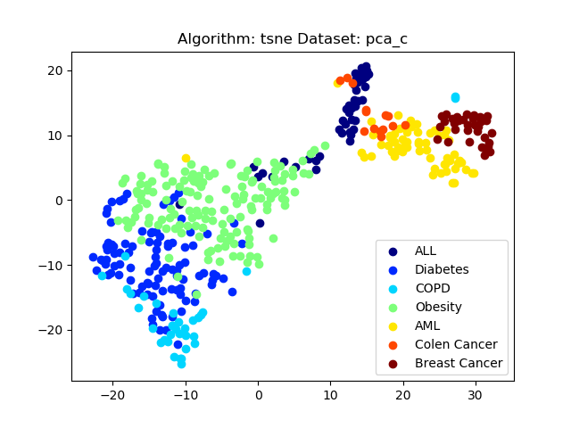

# CSE 601 - Project 1: Dimensionality Reduction & Association Analysis

# Team members:

**Saketh Varma Pericherla** - **sakethva**

**Arvind Thirumurugan** - **athirumu**

**Vijay Jagannathan** - **vijayjag**

# Part 1: Dimensionality Reduction:

## Process:

- The program `part1.py` takes a list of filenames containing the data and a list of algorithms (PCA, SVD, t-SNE) as command line arguments.
- Import the data from the filenames given using `.read_csv(filename, sep="\t", header=None)` in pandas.
- Extract features(X) and labels(y) using `DataFrame.iloc` in pandas.
- Based on the combination of algorithms and datasets chosen perform dimensionality reduction. More details are discussed in the algorithms section below.
- Plot the results as a scatter plot using the `.scatter(X, y)` provided by the matplotlib package.

### Algorithms: PCA, SVD and t-SNE:

PCA performs dimensionality reduction by performing a linear mapping of the data to a lower-dimensional space in such a way that the variance of the data in the low-dimensional representation is maximized.

- Implementation:

  - Adjust the features by subtracting mean from them.
  - Compute the covariance matrix using numpy's `np.cov()`
  - Obtain eigen values and eigen vectos using the covariance matrix
  - Select the top 2 eigenvectors using the corresponding eigen values
  - Finally obtain the new features projected into the two dimensions by performing the dot product between top 2 eigen vectors and your input features

  ```python
  def pca(X):
      X1 = X - X.mean(axis=0)
      cov_matrix = np.cov(X1.T)
      eig_values, eig_vectors = np.linalg.eig(cov_matrix)
      top_eig_indices = eig_values.argsort()[::-1][:2]
      top_eig_vectors = eig_vectors[:, top_eig_indices]
      row_feature_vector = top_eig_vectors.T
      row_data_adjust = X1.T
      new_X = np.dot(row_feature_vector, row_data_adjust).T
      return new_X
  ```

- Similarly, we use `np.linalg.svd(X)` from numpy to perform SVD and `TSNE(n_components, n_iter)` from scikit-learn to implement dimensionality reduction. More discussion about comparison of these three methods is discussed in the inference section

## Results:

### **Dataset: pca_a.txt**

#### <u>PCA</u>:


#### <u>SVD</u>:


<br>
<br>
<br>
<br>
<br>
<br>

#### <u>t-SNE</u>:


### **Dataset: pca_b.txt**

#### <u>PCA</u>:


#### <u>SVD</u>:


<br>
<br>

#### <u>t-SNE</u>:


### **Dataset: pca_c.txt**

#### <u>PCA</u>:


#### <u>SVD:</u>


<br>
<br>

#### <u>t-SNE:</u>



## Observations:

- Unlike PCA, SVD doesn't need the features to be adjusted by subtracting the mean, if we do so the results of SVD and PCA will be identical. Below we compare mean-adjusted SVD vs plain SVD for `pca_a.txt`:

  **PCA**:

  

  **SVD mean-adjusted vs plain SVD:**

  

  

- While PCA and SVD use eigen vectors, t-SNE is based on probabilistic models and outputs distinguishable clusters as it is trained more.
- While PCA uses orthogonal transformations, t-SNE relies on calculating nearest neighbours.
